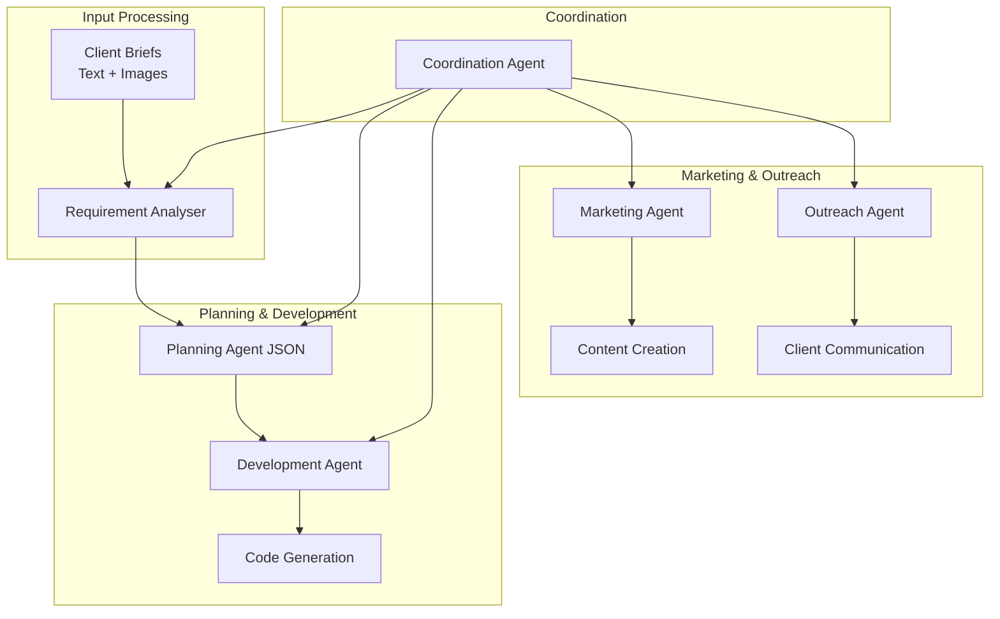

# ☑️ SoloPilot – A-to-Z Freelance Automation System

**SoloPilot** is a modular automation system that transforms raw client requirements into production-ready code. This system orchestrates multiple AI agents to handle the complete freelance development lifecycle.

## 🚀 Quick Start

```bash
# Clone and setup
git clone <repo-url>
cd SoloPilot
pip install -r requirements.txt

# Start local stack
docker-compose up -d

# Run requirement analysis
python scripts/run_analyser.py --path ./sample_input
```

## 🏗️ Architecture



## 📂 Module Overview

| Module | Status | Purpose |
|--------|--------|---------|
| **analyser** | ✅ Active | Parse client requirements into machine-readable specs |
| **planning** | 🔄 Planned | Convert specs into development roadmaps |
| **dev** | 🔄 Planned | Generate production-ready code |
| **marketing** | 🔄 Planned | Create marketing materials and content |
| **outreach** | 🔄 Planned | Handle client communication and proposals |
| **coordination** | 🔄 Planned | Orchestrate multi-agent workflows |

## 🧩 Tech Stack

- **LLM**: Llama 3 8B (local) + OpenAI GPT-4o (fallback)
- **OCR**: pytesseract + Pillow for image analysis
- **Vector Search**: FAISS for similarity lookups
- **Orchestration**: LangChain (lightweight usage)
- **Infrastructure**: Docker + Ollama for local deployment

## 📋 Current Sprint: Requirement Analyser

The analyser module ingests:
- Plain text briefs (MD, TXT, DOCX)
- Images (screenshots, mockups) with OCR
- ZIP archives or multipart uploads

And outputs structured JSON:
```json
{
  "title": "Project Name",
  "summary": "Brief description",
  "features": [{"name": "Feature", "desc": "Description"}],
  "constraints": ["Technical constraints"],
  "assets": {"images": [...], "docs": [...]}
}
```

Plus auto-generated artifacts:
- Mermaid component diagrams
- Task flow charts
- Optional UI wireframes

## 🔧 Development

```bash
# Run tests
pytest tests/

# Local development
python scripts/run_analyser.py --path ./tests/fixtures

# Docker development
docker-compose up --build
```

## 📝 Contributing

This is the initial sprint focusing on MVP-sized projects (≤ 2 weeks dev time). Future sprints will add video/audio processing, authentication, and production deployment.