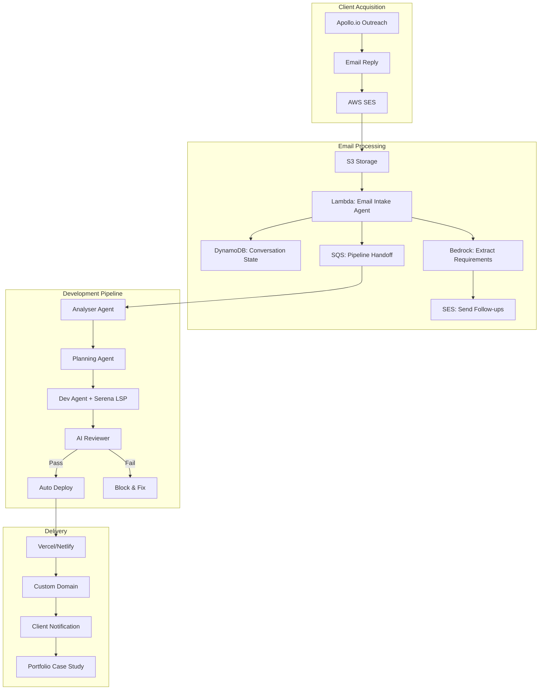

# 🚀 SoloPilot – End-to-End Freelance Automation Platform

[](https://github.com/your-username/SoloPilot/actions)
[](https://sonarcloud.io/summary/new_code?id=solopilot_ai_automation)
[](https://sonarcloud.io/summary/new_code?id=solopilot_ai_automation)
[](https://sonarcloud.io/summary/new_code?id=solopilot_ai_automation)

**SoloPilot** automates the entire freelance development process from client email to deployed website. Our AI agents handle requirements gathering, development, review, and deployment—delivering professional websites in days, not weeks.

## 🎯 Vision

Transform freelance development by automating everything except client relationships:
- **Email arrives** → Requirements extracted via conversational AI
- **AI builds** → Code reviewed automatically with quality gates
- **Deploy happens** → Client gets live site on custom domain
- **Portfolio grows** → Case studies attract more clients

### 🛡️ Production-Ready Features
- **AI Code Review**: Every PR reviewed by AI + SonarCloud
- **Token Optimization**: Serena LSP reduces costs by 50% (822 avg tokens)
- **Quality Gates**: Automated testing on Ubuntu/macOS
- **Cost Control**: <$50/month infrastructure target

## 🌟 Current Status (June 2025)

### ✅ Completed
- **Sprint 1**: AI provider abstraction, cost telemetry, context engines
- **Serena Integration**: Symbol-aware context with 2x token efficiency
- **AI Pair Reviewer**: Automated code review with CI integration
- **Email Intake Agent**: AWS SES-based requirement extraction

### 🚧 In Progress
- **First Client Demo**: End-to-end delivery of real freelance project
- **Deployment Pipeline**: GitHub → Vercel automation

### 📅 Coming Next
- **Client Communication**: Automated progress updates
- **Portfolio Generation**: Case studies from completed projects
- **Billing Integration**: Stripe for payments

## 🏗️ Architecture



## 📂 Project Structure

```
SoloPilot/
├── src/                          # All source code
│   ├── agents/                   # Agent implementations
│   │   ├── analyser/            # Requirements analysis
│   │   ├── dev/                 # Code generation with context engines
│   │   ├── email_intake/        # Email processing & client communication
│   │   ├── marketing/           # Portfolio & case study generation
│   │   ├── planning/            # Project planning & milestones
│   │   └── review/              # AI code review & quality gates
│   ├── providers/               # AI provider implementations
│   │   ├── base.py             # Abstract base provider
│   │   ├── bedrock.py          # AWS Bedrock (Claude)
│   │   ├── openai.py           # OpenAI GPT-4
│   │   └── fake.py             # Testing provider
│   ├── common/                  # Shared utilities
│   │   └── bedrock_client.py   # Centralized Bedrock client
│   └── utils/                   # General utilities
│       ├── github_review.py     # GitHub PR integration
│       ├── linter_integration.py # Code quality tools
│       └── sonarcloud_integration.py # SonarCloud analysis
├── frontend/                    # Frontend applications
│   └── email-intake/           # Email intake dashboard (React)
├── infrastructure/             # Deployment & IaC
│   ├── terraform/             # Infrastructure as Code
│   └── lambda/                # Lambda functions
├── tests/                     # All test files
├── examples/                  # Example inputs & demos
├── scripts/                   # Development & CI scripts
├── docs/                      # Documentation
└── pyproject.toml            # Poetry dependency management
```

## 📋 Module Overview

| Module | Status | Purpose |
|--------|--------|---------|
| **email_intake** | ✅ Active | Process client emails, extract requirements |
| **analyser** | ✅ Active | Parse requirements into structured specs |
| **planning** | ✅ Active | Convert specs into development roadmaps |
| **dev** | ✅ Active | Generate code with Serena context engine |
| **review** | ✅ Active | AI code review + static analysis |
| **deploy** | 🚧 Building | Automated deployment to hosting platforms |
| **marketing** | ✅ Active | Generate announcements and case studies |
| **coordination** | 🔄 Planned | Orchestrate multi-agent workflows |

## 🧩 Tech Stack

### Core Infrastructure
- **Cloud**: AWS (SES, Lambda, DynamoDB, SQS, Bedrock)
- **LLM**: Claude 4 Sonnet via Bedrock (primary), GPT-4 (fallback)
- **Context**: Serena LSP for symbol-aware code understanding
- **Deployment**: Vercel/Netlify with GitHub Actions

### Development Stack
- **Backend**: Python 3.9+, FastAPI, Poetry
- **Frontend**: Next.js 14, TypeScript, Tailwind CSS
- **Database**: Supabase (PostgreSQL + Auth)
- **Payments**: Stripe (planned)

### Quality & Monitoring
- **CI/CD**: GitHub Actions with matrix testing (Python 3.9-3.12)
- **Code Quality**: Pre-commit hooks, Black, isort, Ruff, MyPy, Bandit
- **Static Analysis**: SonarCloud integration
- **Monitoring**: CloudWatch, custom telemetry
- **Cost Tracking**: Per-call LLM logging to `logs/llm_calls.log`

## 🚀 Quick Start

### Prerequisites
```bash
# AWS CLI configured with credentials
aws configure

# Python 3.9+ and Node.js 18+
python --version  # 3.9 or higher
node --version    # 18 or higher

# Install Poetry (dependency management)
curl -sSL https://install.python-poetry.org | python3 -
```

### Local Development
```bash
# Clone and setup
git clone <repo-url>
cd SoloPilot

# Install dependencies with Poetry
poetry install

# Install pre-commit hooks
poetry run pre-commit install

# Run the full pipeline
poetry run make plan-dev

# With Serena context engine
CONTEXT_ENGINE=serena poetry run make dev

# Run tests
poetry run pytest

# Run linting and formatting
poetry run pre-commit run --all-files
```

### Email Intake Setup
```bash
# 1. Configure AWS SES domain
# 2. Create S3 bucket for emails
# 3. Deploy Lambda function
cd agents/email_intake
zip -r email-intake.zip .
# Upload to Lambda

# 4. Set environment variables
REQUIREMENT_QUEUE_URL=<your-sqs-queue>
SENDER_EMAIL=<your-verified-email>
DYNAMO_TABLE=conversations
```

## ⚙️ Configuration

### Environment Variables

**AI Provider Settings:**
- `AI_PROVIDER`: bedrock (default) | fake | openai
- `BEDROCK_IP_ARN`: Claude 4 Sonnet inference profile
- `NO_NETWORK`: Force offline mode for testing

**Context Engine Settings:**
- `CONTEXT_ENGINE`: serena (recommended) | legacy | lc_chroma
- `SERENA_BALANCED_TARGET`: Token budget (default: 1500)
- `SERENA_TELEMETRY_ENABLED`: Production monitoring

**Deployment Settings:**
- `VERCEL_TOKEN`: For automated deployments
- `GITHUB_TOKEN`: For PR reviews
- `SONAR_TOKEN`: For code quality analysis

## 📋 Development Workflow

### Standard Commands
```bash
# Activate environment
source .venv/bin/activate

# Run tests
make test

# Lint and format
make lint

# Full pipeline test
make plan-dev

# Deploy to production
make deploy
```

### AI Review Workflow
```bash
# Review current code
make review

# If review passes, promote to staging
make promote

# Generate marketing announcement
make announce
```

## 🔍 Quality Assurance

### Automated Checks
1. **AI Code Review**: Every PR reviewed for bugs, security, performance
2. **Static Analysis**: Ruff, MyPy, Black formatting
3. **SonarCloud**: Security vulnerabilities and code smells
4. **Token Validation**: CI enforces <2000 tokens per call

### Manual Verification
- Review `logs/llm_calls.log` for cost monitoring
- Check `serena_telemetry.jsonl` for performance metrics
- Verify deployment smoke tests pass

## 📈 Metrics & Monitoring

### Key Performance Indicators
- **Token Usage**: 822 avg per context (target: <1500)
- **Response Time**: <3s for email processing
- **Pipeline Duration**: <10 mins from email to deployed site
- **Cost per Project**: <$5 in LLM calls

### Telemetry
When `SERENA_TELEMETRY_ENABLED=1`:
- Token usage per request
- Symbol lookup performance
- Budget violations
- Response times

## 🎯 Roadmap

### Phase 1: MVP (Current)
- ✅ Core agent pipeline
- ✅ Email intake system
- 🚧 Deployment automation
- 🚧 First client demo

### Phase 2: Scale (July 2025)
- Multi-channel intake (SMS, chat)
- Payment automation
- Client portal
- Advanced project types

### Phase 3: Growth (August 2025)
- Team collaboration features
- White-label options
- API for integrations
- Global deployment regions

## 📝 License

Proprietary - SoloPilot AI Automation
