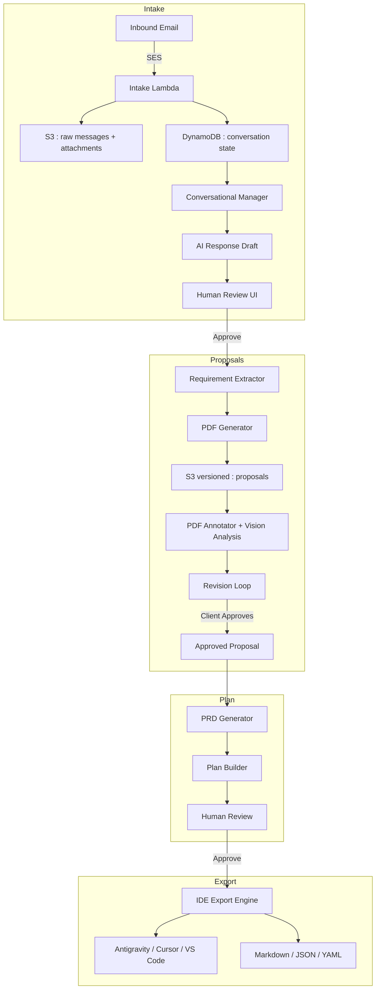

# SoloPilot — Client-to-Codebase Bridge

SoloPilot automates the client intake workflow — from email threads to approved proposals to structured plans ready for AI powered IDEs like Antigravity, Cursor, and VS Code.

## Vision

Bridge the gap between client conversations and code:
- **Intake**: Manage email threads, extract requirements, draft responses with human review
- **Proposals**: Generate, annotate, and version PDF proposals with full revision history
- **Plan**: Transform approved proposals into structured PRDs and project plans
- **Export**: Output plans in formats optimized for AI coding assistants

SoloPilot handles the messy client → requirements → proposal → plan workflow so you can jump straight into building.

## Key Capabilities

- **Email Intake Console**: Conversational manager that groups threads, extracts requirements, and prepares draft responses
- **AI Response Generation**: Draft email replies with evaluator-revisor loop for quality scoring
- **Metadata Extraction**: AI-powered extraction of project type, budget, timeline, client name, and key requirements
- **Proposal PDFs with Versioning**: Render proposals via React-PDF; each revision stored as versioned S3 object for audit and rollback
- **PDF Annotation**: Annotate proposals directly with vision analysis feedback
- **PRD/Plan Generation**: Create detailed project plans with milestones, tasks, and acceptance criteria from approved proposals
- **IDE Export**: Export plans in formats optimized for Antigravity, Cursor, and VS Code agents
- **Provider-Agnostic LLM Layer**: Swap models (Bedrock, OpenAI) via unified interface
- **Ops on AWS**: S3 (versioned proposals and artifacts), Lambda, DynamoDB, CloudWatch

## Current Status (December 2025)

### Completed
- Email intake console and conversational manager
- AI-powered metadata and requirement extraction
- Proposal PDF rendering, annotation, and S3 versioned storage
- Vision analysis for PDF feedback
- Evaluator-and-revisor loop for email copy
- Human-in-the-loop review UI with approve/reject/edit workflow
- Provider abstraction and centralized LLM logging
- Client simulation testing utility

### In Progress
- PRD/Plan generation from approved proposals
- IDE export formats (Antigravity, Cursor, VS Code)

### Next (Planned)
- Template library for different project types
- Multi-format export (Markdown, JSON, YAML)
- Lightweight client portal for approvals
- Multi-channel intake (beyond email)

## Architecture



## Project Structure

```text
SoloPilot/
├── src/
│   ├── agents/
│   │   ├── email_intake/          # Email console + conversational manager
│   │   │   ├── conversational_responder.py
│   │   │   ├── metadata_extractor.py
│   │   │   ├── requirement_extractor.py
│   │   │   ├── pdf_generator.py
│   │   │   ├── vision_analyzer.py
│   │   │   ├── reviewer.py
│   │   │   └── response_reviser.py
│   │   ├── planning/              # PRD and plan generation
│   │   └── export/                # IDE export formats
│   ├── providers/                 # Model/provider abstraction
│   └── utils/                     # Helpers
├── frontend/
│   └── email-intake/              # React dashboard
│       └── src/components/
│           ├── ConversationDetail.tsx
│           ├── ConversationList.tsx
│           ├── ProposalViewer.tsx
│           ├── PDFAnnotator.tsx
│           └── ReplyEditor.tsx
├── infrastructure/                # Terraform + Lambda
├── tests/
└── docs/
```

## Module Overview

| Module             | Status   | Purpose                                           |
|--------------------|----------|---------------------------------------------------|
| email_intake       | ✅ Active | Triage threads, draft responses, manage state     |
| metadata_extractor | ✅ Active | Extract client info, project type, budget, etc.   |
| requirement_extractor | ✅ Active | Synthesize requirements from conversations     |
| pdf_generator      | ✅ Active | Render proposal PDFs with versioning              |
| vision_analyzer    | ✅ Active | AI-powered PDF annotation feedback                |
| reviewer           | ✅ Active | Score and evaluate draft responses                |
| response_reviser   | ✅ Active | Generate improved response alternatives           |
| planning           | 🚧 WIP   | Generate PRDs and structured project plans        |
| export             | 🚧 WIP   | Export to IDE-ready formats                       |

## Tech Stack
- **Core**: Python, TypeScript, AWS, LangChain
- **LLMs**: AWS Bedrock (Claude), OpenAI
- **Frontend**: React, Vite, TailwindCSS
- **Storage**: S3 (versioned), DynamoDB
- **Quality**: GitHub Actions, ruff, mypy, ESLint

## Quick Start

### Prerequisites

```bash
aws configure                # AWS credentials
python --version             # 3.9+
node --version               # 18+
```

### Local Development

```bash
git clone <repo-url> && cd SoloPilot
poetry install
poetry run pre-commit install
poetry run pytest

# Frontend
cd frontend/email-intake
yarn install
yarn dev
```

## Email Intake Setup

```bash
# 1) Verify domain in SES
# 2) Create S3 bucket with versioning enabled
# 3) Deploy the intake Lambda
cd src/agents/email_intake && ./deploy.sh

# Environment variables
export EMAIL_BUCKET=<S3 bucket>
export DYNAMO_TABLE=conversations
export SENDER_EMAIL=<verified SES sender>
export AI_PROVIDER=bedrock
```

## IDE Export Formats

SoloPilot generates plans optimized for AI coding assistants:

| Format | IDE Target | Description |
|--------|------------|-------------|
| `.antigravity/` | Antigravity | Task files with context and instructions |
| `.cursor/` | Cursor | Rules and project context |
| `AGENTS.md` | VS Code Copilot | Agent instructions and project overview |
| `plan.json` | Universal | Structured plan data for custom integrations |

## Roadmap

### Phase 1: Intake & Proposals ✅
- Email intake console with conversation management
- AI-powered metadata and requirement extraction
- Proposal PDF generation with versioning and annotations
- Human review workflow with evaluator-revisor loop

### Phase 2: Plan & Export 🚧
- PRD generation from approved proposals
- IDE export (Antigravity, Cursor, VS Code)
- Template library for common project types

### Phase 3: Expand
- Multi-channel intake (Slack, forms)
- Client portal for approvals
- Team collaboration features