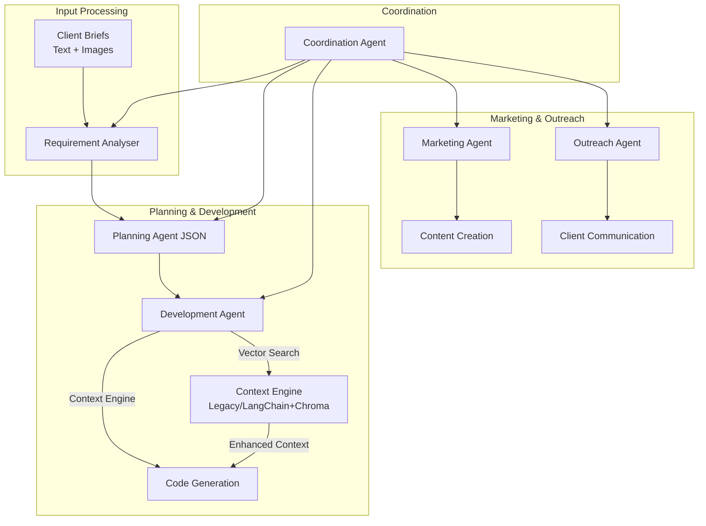

# ☑️ SoloPilot – A-to-Z Freelance Automation System

[](https://github.com/your-username/SoloPilot/actions)

**SoloPilot** is a modular automation system that transforms raw client requirements into production-ready code. This system orchestrates multiple AI agents to handle the complete freelance development lifecycle.

## 🚀 Quick Start

### Local Development (Recommended)

```bash
# Clone and setup
git clone <repo-url>
cd SoloPilot

# Create virtual environment (avoids PEP 668 restrictions)
python3 -m venv .venv
source .venv/bin/activate

# Install dependencies
pip install --upgrade pip
pip install -r requirements.txt

# Install system dependencies (macOS)
brew install tesseract

# Run requirement analysis
python scripts/run_analyser.py --path ./sample_input
```

### Docker Alternative (Zero Host Setup)

```bash
# Start local stack with Ollama + analyser
docker-compose up --build

# The compose file handles all dependencies automatically
```

## 🏗️ Architecture



## 📂 Module Overview

| Module | Status | Purpose |
|--------|--------|---------|
| **analyser** | ✅ Active | Parse client requirements into machine-readable specs |
| **planning** | ✅ Active | Convert specs into development roadmaps |
| **dev** | ✅ Active | Generate milestone-based code with Context7 integration |
| **marketing** | 🔄 Planned | Create marketing materials and content |
| **outreach** | 🔄 Planned | Handle client communication and proposals |
| **coordination** | 🔄 Planned | Orchestrate multi-agent workflows |

## 🧩 Tech Stack

- **LLM**: AWS Bedrock Claude 4 Sonnet with provider-agnostic architecture
- **Context Engine**: LangChain + ChromaDB for enhanced code generation context
- **OCR**: pytesseract + Pillow for image analysis
- **Vector Search**: FAISS + ChromaDB for similarity lookups
- **Orchestration**: LangChain (lightweight usage)
- **Infrastructure**: Docker + AWS Bedrock for scalable deployment

## ⚙️ Configuration

### Environment Variables

Control system behavior with these environment variables:

**AI Provider Settings:**
- `AI_PROVIDER`: Choose provider (bedrock/fake/codewhisperer, default: bedrock)
- `BEDROCK_IP_ARN`: Inference profile ARN (overrides config)
- `BEDROCK_REGION`: AWS region (default: us-east-2)
- `AWS_ACCESS_KEY_ID` / `AWS_SECRET_ACCESS_KEY`: AWS credentials

**Context Engine Settings:**
- `CONTEXT_ENGINE`: Choose engine (legacy/lc_chroma, default: legacy)
- `NO_NETWORK`: Force offline mode (1=offline, forces fake provider + legacy engine)

**Performance Settings:**
- `C7_SCOUT`: Enable Context7 MCP integration (1=enabled)

Example:
```bash
# Use enhanced context engine with Bedrock
export AI_PROVIDER="bedrock"
export CONTEXT_ENGINE="lc_chroma"
export BEDROCK_IP_ARN="arn:aws:bedrock:us-west-2:392894085110:inference-profile/us.anthropic.claude-3-5-sonnet-20241022-v2:0"
make dev

# Offline development mode
export NO_NETWORK=1
make dev
```

## 📋 Current Sprint: Requirement Analyser

The analyser module ingests:
- Plain text briefs (MD, TXT, DOCX with full table support)
- Images (screenshots, mockups) with OCR
- ZIP archives or multipart uploads

And outputs structured JSON:
```json
{
  "title": "Project Name",
  "summary": "Brief description",
  "features": [{"name": "Feature", "desc": "Description"}],
  "constraints": ["Technical constraints"],
  "assets": {"images": [...], "docs": [...]}
}
```

Plus auto-generated artifacts:
- Mermaid component diagrams
- Task flow charts
- Optional UI wireframes

## 🔧 Development

```bash
# Setup virtual environment (first time only)
python3 -m venv .venv
source .venv/bin/activate
pip install -r requirements.txt

# Activate environment (subsequent sessions)
source .venv/bin/activate

# Run tests (includes context engine tests)
pytest tests/

# Build/update vector index for context engine
make index

# Full pipeline: analyser → planner → dev agent
make plan-dev

# Enhanced dev agent with Context7 scouting
make dev-scout

# Local development commands
python scripts/run_analyser.py --path ./tests/fixtures
python scripts/run_planner.py --latest
python scripts/run_dev_agent.py

# Quick demo with sample data
./scripts/demo.sh

# Docker development
docker-compose up --build
```

## 📝 Contributing

This is the initial sprint focusing on MVP-sized projects (≤ 2 weeks dev time). Future sprints will add video/audio processing, authentication, and production deployment.