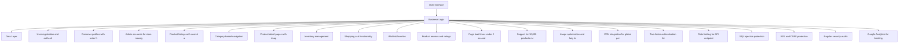

# Component Diagram

```mermaid
graph TD
    A[User Interface] --> B[Business Logic]
    B --> C[Data Layer]
    B --> F1[User registration and authenti]
    B --> F2[Customer profiles with order h]
    B --> F3[Admin accounts for store manag]
    B --> F4[Product listings with search a]
    B --> F5[Category-based navigation]
    B --> F6[Product detail pages with imag]
    B --> F7[Inventory management]
    B --> F8[Shopping cart functionality]
    B --> F9[Wishlist/favorites]
    B --> F10[Product reviews and ratings]
    B --> F11[Page load times under 2 second]
    B --> F12[Support for 10,000 products mi]
    B --> F13[Image optimization and lazy lo]
    B --> F14[CDN integration for global per]
    B --> F15[Two-factor authentication for ]
    B --> F16[Rate limiting for API endpoint]
    B --> F17[SQL injection protection]
    B --> F18[XSS and CSRF protection]
    B --> F19[Regular security audits]
    B --> F20[Google Analytics for tracking]
```