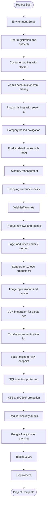

# Task Flow

```mermaid
flowchart TD
    Start([Project Start]) --> Setup[Environment Setup]
    Setup --> F1[User registration and authenti]
    F1 --> F2[Customer profiles with order h]
    F2 --> F3[Admin accounts for store manag]
    F3 --> F4[Product listings with search a]
    F4 --> F5[Category-based navigation]
    F5 --> F6[Product detail pages with imag]
    F6 --> F7[Inventory management]
    F7 --> F8[Shopping cart functionality]
    F8 --> F9[Wishlist/favorites]
    F9 --> F10[Product reviews and ratings]
    F10 --> F11[Page load times under 2 second]
    F11 --> F12[Support for 10,000 products mi]
    F12 --> F13[Image optimization and lazy lo]
    F13 --> F14[CDN integration for global per]
    F14 --> F15[Two-factor authentication for ]
    F15 --> F16[Rate limiting for API endpoint]
    F16 --> F17[SQL injection protection]
    F17 --> F18[XSS and CSRF protection]
    F18 --> F19[Regular security audits]
    F19 --> F20[Google Analytics for tracking]
    F20 --> Test[Testing & QA]
    Test --> Deploy[Deployment]
    Deploy --> End([Project Complete])
```